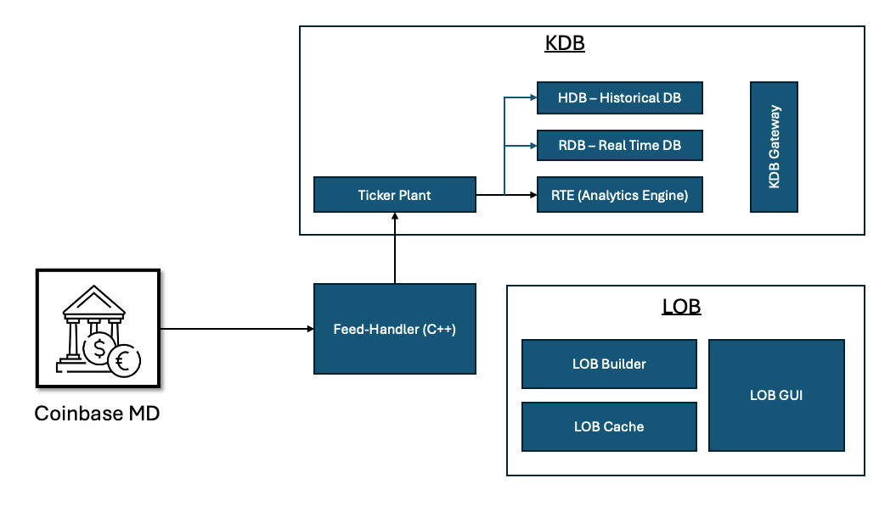

# Market-Making

## Dev-Env Setup
To setup the development following the steps below:
-  Install Virtual box from the following website: https://www.virtualbox.org/
-  After Virtual box has been installed, you will need to go to the ubuntu website and download the ubuntu 24 LTS '.iso' OS image version from: https://ubuntu.com/download/desktop

### Ubuntu Image Setup
When setting up the linux environment, open the virtual box application and select on new, this will prompt you to give your environment a name (whitespace is not valid within the name) and select the downloaded ubuntu image ('.iso') to use. Once the image has been downloaded, you will have to allocate cores and RAM to your virtual environment. You should allocate half the number of cores your system has and a RAM of 4096MB. Select the default tick boxes during the setup. 

### Ubuntu 24.04
Once your linux environment is up and running, install the following software from the software centre for ubuntu:
  - Code (Visual Studio Code)
  - Docker
  - Microk8s for kuburnetes
  - Kubectl

### Network Port Configuration
TBD


### Docker Setup
If you run the 'docker ps' command and the following error appears:
  1.)  Got permission denied while trying to connect to the Docker daemon socket

The solution is to run the following command:
  1.) sudo chmod 666 /var/run/docker.sock

  2.) containers/create: dial unix /var/run/docker.sock: connect: permission denied
  
The solution is to run the following command:
  2.) sudo setfacl --modify user::rw /var/run/docker.sock


### System Design (Draft)



## CMake Guide

### To Build 

In the parent directory run :
```
cmake --build ./build/
```
This command will create executables in ./build/[SUB DIR]. To run executable :

```
./build/test/MainExec
```
or 
```
./build/test/example_test 
```


## KDB Ticker Plant Setup

To run a KDB+ service in docker, the following files are required:

- q.k (K (q) source code)
- l64 (linux x64)
  - q
- kc.lic (kdb licence)


### Linux Dependecies to run q 

- rlwrap